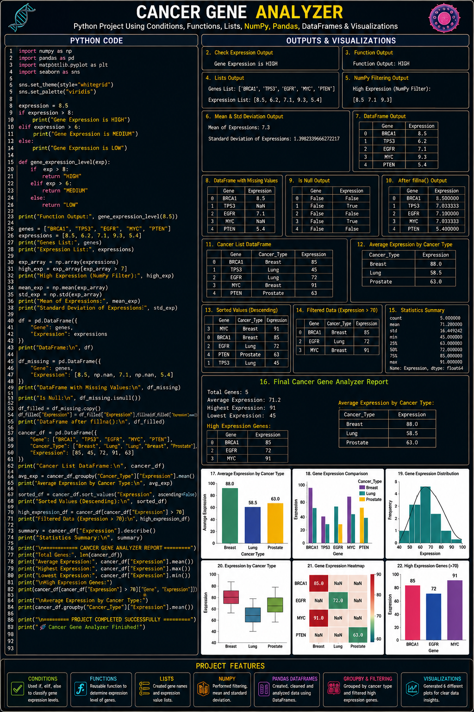

# 🧬 Cancer Gene Analyzer

### **Computational Biology | Gene Expression Analysis | Python | NumPy | Pandas**

> **A professional Computational Biology project that analyzes cancer-related gene expression data using Python, NumPy, and Pandas to identify expression patterns, compare cancer groups, handle missing data, and generate meaningful biological insights.**

---

## 🔬 Project Overview

**Cancer Gene Analyzer** is a Python-based biological data analysis project designed to work with **cancer gene-expression data**.

The project combines **Python programming, NumPy numerical analysis, Pandas DataFrames, statistics, data cleaning, filtering, grouping, sorting, and visualization** to transform raw biological data into useful analytical results.

This project provides a strong foundation for future **Computational Biology, Data Science, and Machine Learning** applications.

---

## 🧬 Concepts & Their Benefits

### **1️⃣ Conditions**

Uses `if`, `elif`, and `else` to classify gene-expression levels.

**Benefit:** Helps categorize genes into different expression levels such as **High, Medium, and Low**.

---

### **2️⃣ Functions**

Reusable Python functions are used for gene-expression analysis.

**Benefit:** Makes the code **organized, reusable, and easier to maintain**.

---

### **3️⃣ Lists**

Genes, cancer types, and expression values are initially stored using Python lists.

**Benefit:** Provides a simple way to **store and manage biological data** before analysis.

---

### **4️⃣ NumPy Filtering**

NumPy arrays are used to filter expression values based on biological conditions.

**Benefit:** Makes numerical filtering **fast, efficient, and suitable for large datasets**.

---

### **5️⃣ Mean & Standard Deviation**

The project calculates the average gene expression and its variation.

**Benefit:** Helps understand the **central tendency and variability** of gene-expression data.

---

### **6️⃣ Pandas DataFrame**

Biological data is converted into a structured **Pandas DataFrame** containing genes, cancer types, and expression values.

**Benefit:** Makes biological datasets easier to **inspect, process, filter, sort, group, and analyze**.

---

### **7️⃣ Missing Data — `isnull()`**

The project detects missing gene-expression values using:

```python
df.isnull()
```

**Benefit:** Identifies incomplete biological records before analysis.

---

### **8️⃣ Missing Data — `fillna()`**

Missing expression values are handled using:

```python
df["Expression"].fillna(...)
```

**Benefit:** Prevents missing values from causing problems during statistical analysis.

---

### **9️⃣ GroupBy Analysis**

Gene-expression data is grouped according to cancer type.

```python
df.groupby("Cancer_Type")["Expression"].mean()
```

**Benefit:** Allows comparison of **average gene expression between different cancer groups**.

---

### **🔟 Sorting**

Gene-expression records are sorted from highest to lowest expression.

**Benefit:** Makes it easier to identify **highly expressed genes**.

---

### **1️⃣1️⃣ Filtering**

Genes above a specific expression threshold are extracted.

**Benefit:** Helps identify **high-expression genes** for further biological investigation.

---

### **1️⃣2️⃣ Descriptive Statistics**

The project uses Pandas statistical functions such as:

```python
df["Expression"].describe()
```

**Benefit:** Provides a complete statistical overview including **count, mean, standard deviation, minimum, maximum, and quartiles**.

---

### **1️⃣3️⃣ Final Analysis Report**

The project generates a final summary containing important analytical results.

**Benefit:** Converts raw calculations into a **clear and understandable biological report**.

---

## 📊 DataFrame Analysis

The project transforms biological information into a structured DataFrame:

| Gene  | Cancer Type | Expression |
| ----- | ----------- | ---------: |
| BRCA1 | Breast      |        8.5 |
| TP53  | Lung        |        7.4 |
| EGFR  | Lung        |        9.2 |
| MYC   | Breast      |        8.7 |
| PTEN  | Prostate    |        6.3 |

This DataFrame becomes the main structure for **data cleaning, filtering, sorting, grouping, and statistical analysis**.

---

## 🔢 NumPy Analysis

NumPy is used for numerical operations such as:

* Expression arrays
* Numerical filtering
* Mean calculation
* Standard deviation
* Efficient numerical processing

Example:

```python
high_expression = expression[expression > 7]
```

This extracts genes with expression values greater than `7`.

---

## 📈 Visualizations

The project includes professional visualizations to make biological patterns easier to understand:

* 📊 **Average Gene Expression by Cancer Type**
* 📈 **Gene Expression Distribution**
* 🧬 **Gene Expression Comparison**
* 🔥 **Gene Expression Heatmap**

### **Project Visualization**



---

## 🔄 Analysis Workflow

```text
🧬 Biological Data
       ↓
📋 Python Lists
       ↓
🐼 Pandas DataFrame
       ↓
🔍 Missing Data Detection
       ↓
🔧 Data Cleaning
       ↓
🔢 NumPy Filtering
       ↓
📊 Statistical Analysis
       ↓
👥 GroupBy Cancer Type
       ↓
🔎 Filtering & Sorting
       ↓
📈 Visualization
       ↓
🧠 Biological Insights
       ↓
📄 Final Report
```

---

## 🛠️ Technologies Used

| Technology        | Role                               |
| ----------------- | ---------------------------------- |
| 🐍 **Python**     | Core programming & logic           |
| 🔢 **NumPy**      | Numerical calculations & filtering |
| 🐼 **Pandas**     | DataFrames & data analysis         |
| 📊 **Matplotlib** | Data visualization                 |
| 🎨 **Seaborn**    | Statistical visualization          |

---

## 🌟 Why This Project Matters

This project demonstrates how **computational methods can be applied to biological data**.

Instead of manually examining gene-expression values, computational analysis can help researchers:

* Identify expression patterns
* Compare cancer groups
* Detect highly expressed genes
* Handle incomplete datasets
* Summarize large amounts of biological data
* Prepare data for Machine Learning

---

## 🚀 Future Scope

The project can be upgraded into advanced Computational Biology applications:

```text
Gene Expression Analysis
        ↓
Machine Learning
        ↓
Cancer Classification
        ↓
Biomarker Identification
        ↓
Gene Correlation Analysis
        ↓
Drug-Target Prediction
        ↓
Computational Drug Discovery
```

---

## ⚠️ Disclaimer

This project is intended for **educational and research purposes only**. It is not a medical diagnostic system and should not be used for clinical decision-making.

---

## 👨‍💻 Author

### **Muhammad Maaz**

🧬 **Coding With Maazi**

> **Turning Biological Data into Meaningful Computational Insights.**

